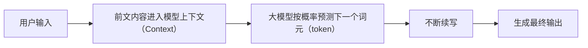

# 第一章 什么是大模型

## 读前先想

- 如果不先搞懂大模型在做什么，后面的提示词、工具和智能体（Agent）为什么会越学越乱？
- 大模型既然只是“按概率接着写”，后面那些技术为什么都绕不开模型上下文（Context）？

## 章节定位

| 维度 | 内容 |
| --- | --- |
| 横向定位 | 这是全项目的共同基础章节，不站在某一派上。 |
| 本章回扣 | 1. 大模型本质上是生成文字的概率模型。 2. 后面的很多技术，本质上都在补充和管理模型上下文（Context）。 |

## 第一小节：本质：按概率生成词元（token）

### 提问

- 为什么今天大家会把大模型当成 AI 讨论的起点？
- 为什么这里不先讲“它很聪明”，而是先讲“它在按概率续写”？
- 为什么本项目要用“概率生成”这个框架来打开后面所有章节？

### 术语

- 中文：大语言模型
- 英文：Large Language Model
- 简称：`LLM`
- 补充：词元（`token`）现在可以先理解成文字片段

### 一句话解释

大模型本质上是一个会根据前文，按概率生成下一个词元（`token`）的模型。

### 你可以先这样理解

- 如果你不先理解这一点，后面很多“它为什么会答错”“它为什么会跑偏”就会显得很神秘。
- 这里先讲“按概率生成”，不是为了故意讲得冷冰冰，而是为了把最底层的工作方式先说明白。
- 它不是先把事情彻底想明白，再一次性说出来；它更像是看着前面已有的内容，持续判断下一个词元（`token`）最可能是什么。

### 流程图

### 示例

如果你输入：

`帮我写一句开会迟到时的道歉话`

它可能生成：

`不好意思，我刚才路上有点堵，耽误了几分钟。`

它之所以能这样写，不是因为它真的经历过这个场景，而是因为在大量语言材料里，这样接下去更常见，也更符合语境。

### 你只需要记住

- `LLM` 是大语言模型。
- 它的底层工作方式，是预测下一个词元（`token`）。
- 它看起来像在思考，但底层首先是在做概率生成。

## 第二小节：一切工作都是为了模型上下文（Context）

### 提问

- 为什么模型上下文（Context）会变成后面几乎所有 AI 技术的共同关键词？
- 为什么只理解模型本身还不够，还要理解模型当前到底看到了什么？
- 为什么本项目要在第一章就把模型上下文（Context）提前讲清楚？

### 术语

- 中文：模型上下文
- 英文：Context
- 补充：可以先理解成模型当前能看到的信息

### 一句话解释

大模型生成得好不好，很大程度上取决于它当前拿到的模型上下文（Context）是否清楚。

### 你可以先这样理解

- 如果第一节回答的是“模型到底在做什么”，这一节回答的就是“模型到底拿什么来做”。
- 模型上下文（Context）就是模型当前能看到的信息。
- 你的问题、背景、目标、限制、示例，都会影响它接下来怎么生成。
- 很多看起来不同的 AI 方法，往下拆其实都在做同一件事：把模型上下文给清楚。

### 表格

| 信息类型 | 例子 | 会不会进入模型上下文 | 作用 |
| --- | --- | --- | --- |
| 用户问题 | 帮我写周报 | 会 | 决定任务方向 |
| 背景资料 | 本周做了用户访谈和竞品整理 | 会 | 决定内容贴合度 |
| 限制条件 | 150 字以内，语气正式 | 会 | 决定输出边界 |
| 示例 | 参考上周周报格式 | 会 | 决定表达方式 |

### 示例

如果你只说：

`帮我写个周报`

它很可能写得很空，也不一定符合你的场景。

但如果你说：

`帮我写个周报，面向产品经理，语气简洁，本周做了用户访谈、整理竞品、输出需求文档，控制在 150 字以内`

它通常就会写得更贴近你的目标。

差别不在于模型突然更聪明了，而在于你给的模型上下文（Context）更清楚了。

### 你只需要记住

- 模型上下文（Context）就是模型当前能看到的信息。
- 你给的信息越清楚，结果通常越稳。
- 很多 AI 使用方法，核心都和整理模型上下文（Context）有关。
