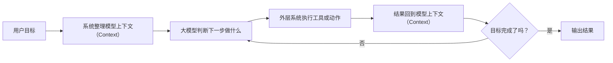

# 第四章 智能体（Agent）到底是怎么工作的

## 读前先想

- 智能体（Agent）看起来会连续做事，它到底比聊天机器人多了什么？
- 它明明还是大语言模型（Large Language Model，`LLM`），为什么会让人觉得像“自己在做事”？

## 章节定位

| 维度 | 内容 |
| --- | --- |
| 横向定位 | 这一章更偏向驾驭工程派（Harness Engineering），但会反复说明它仍然建立在大语言模型（Large Language Model，`LLM`）之上。 |
| 本章回扣 | 1. 智能体（Agent）底层仍然是生成文字的概率模型。 2. 智能体（Agent）之所以看起来会连续做事，是因为外层系统在持续组织模型上下文（Context）、工具和多步循环。 |

## 总流程占位

## 第一节：先别把智能体（Agent）想成另一种“大脑”

### 提问

- 为什么智能体（Agent）会给人一种“它像换了个大脑”的感觉？
- 为什么这里要先把这种直觉打断，而不是顺着它讲？
- 为什么这一节要先用“系统形态”而不是“新模型种类”的框架来看智能体（Agent）？

### 术语

- 中文：智能体
- 英文：Agent

### 一句话解释

智能体（Agent）不是另一种全新的“大脑”，而是“模型 + 模型上下文（Context）+ 工具 + 执行循环”拼起来的系统。

### 你可以先这样理解

- 后续会重点讲：为什么同一个模型，放进不同系统里，表现会差很多。
- 后续会重点讲：智能体（Agent）为什么看起来更像在连续做事，而不是只答一句话。
- 先把它理解成“系统”，后面很多现象就更容易解释。

### 示例

- 占位：这里后续会补“读代码 -> 改文件 -> 跑命令 -> 看报错 -> 再改一次”这类连续任务的例子。

### 你只需要记住

- 智能体（Agent）首先是一种系统形态，不是一种突然变种的新模型。
- 它真正强的地方，往往不只在模型本身，而在外层系统怎么把东西组织起来。

## 第二节：一个智能体（Agent）最常见的工作回路是什么

### 提问

- 为什么很多智能体（Agent）产品最后都会长成“做一步、看结果、再决定下一步”的样子？
- 为什么只要任务一变长，系统就必须开始显式管理步骤和状态？
- 为什么这里要用“执行循环”这个框架来理解智能体（Agent）的日常工作？

### 术语

- 中文：执行循环
- 英文：execution loop
- 补充：这里先白话理解成“做一步，看结果，再决定下一步”

### 一句话解释

很多智能体（Agent）产品，核心都离不开“判断下一步 -> 执行动作 -> 看结果 -> 再判断”的循环。

### 你可以先这样理解

- 后续会拆开讲：目标从哪里来、模型上下文（Context）怎么组织、工具怎么接入、结果怎么回填。
- 后续也会讲：为什么只要这个循环一拉长，成本、权限和跑偏风险就会一起上来。
- 这一节是后面所有产品对比的底图。

### 表格

| 回路环节 | 后续重点会讲什么 |
| --- | --- |
| 接到目标 | 用户到底让它做什么 |
| 整理信息 | 哪些内容会进入模型上下文（Context） |
| 判断下一步 | 模型怎么决定先做什么 |
| 调工具执行 | 真正执行动作的是谁 |
| 读取结果 | 结果怎么影响下一步 |
| 判断结束 | 什么时候该停，什么时候该继续 |

### 你只需要记住

- 智能体（Agent）最重要的不是“会不会说”，而是“能不能围绕目标稳定地转完这个回路”。

## 第三节：为什么有的智能体（Agent）像在帮你干活，有的却像在瞎忙

### 提问

- 为什么看起来都叫智能体（Agent），实际体验却能差很多？
- 为什么很多失败表面像“模型不聪明”，底层却是信息、工具或约束没接好？
- 为什么这里要用“模型上下文（Context）+ 工具 + 边界”这个框架来排查问题？

### 术语

- 中文：模型上下文
- 英文：Context

### 一句话解释

智能体（Agent）表现稳不稳，很多时候取决于它拿到的模型上下文（Context）清不清楚、工具能不能用、边界管没管住。

### 你可以先这样理解

- 后续会讲：很多“看起来像模型太笨”的问题，实际是系统给它的信息和工具不对。
- 后续会讲：为什么智能体（Agent）越接近真实工作，越离不开权限、确认、重试和终止条件。
- 这一节会和第六章的排查思路直接接起来。

### 示例

- 占位：这里后续会补“明明能读文件，却读错目录”“明明能调工具，却拿错参数”这类案例。

### 你只需要记住

- 智能体（Agent）不是自动就更稳。
- 它能不能真的帮上忙，关键看外层系统把信息、工具和约束接得怎么样。

## 第四节：这一章后面会重点拆哪些部件

### 提问

- 为什么这一章不能只用一句“智能体（Agent）就是会自己干活”带过去？
- 为什么要把智能体（Agent）拆成若干部件，而不是整体讲一个大印象？
- 为什么这里要提前把后面的拆解框架列出来？

### 术语

- 中文：章节骨架
- 英文：chapter outline

### 一句话解释

这一章后续会围绕几个固定部件展开，而不是泛泛地讲“智能体（Agent）很厉害”。

### 你可以先这样理解

- 后续准备展开的部件包括：目标、模型上下文（Context）、工具、执行循环、记忆、权限、终止条件。
- 这样写的目的，是让读者能把不同产品放到同一张图里理解。
- 先把框架列出来，后面具体案例才不会越写越散。

### 表格

| 后续小节 | 准备回答的问题 |
| --- | --- |
| 目标 | 智能体（Agent）到底是围绕什么在工作 |
| 模型上下文（Context） | 它当前到底看到了什么 |
| 工具 | 它能做什么，不能做什么 |
| 执行循环 | 它为什么能连续推进任务 |
| 记忆与状态 | 为什么它能接住前一步结果 |
| 约束与权限 | 为什么真实产品不可能完全放开 |

### 你只需要记住

- 这一章的任务，是先把智能体（Agent）拆开。
- 拆开之后，下一章的产品对比才不会只停留在表面名字上。
