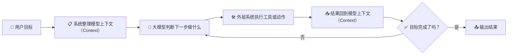

# 🤖 第四章 智能体是怎么"干活"的？

## 🤔 读前先想

- 智能体（Agent）看起来会连续做事，它到底比聊天机器人多了什么？
- 它明明还是大语言模型（Large Language Model，`LLM`），为什么会让人觉得像"自己在做事"？

## 🧭 章节定位

| 维度 | 内容 |
|:---|:---|
| 📍 横向定位 | 这一章更偏向驾驭工程派（Harness Engineering），但会反复说明它仍然建立在大语言模型（Large Language Model，`LLM`）之上。 |
| 🎯 本章回扣 | 1. 回到本质一：智能体（Agent）底层仍然是生成文字的概率模型。<br>2. 回到本质二：智能体（Agent）之所以看起来会连续做事，是因为外层系统在持续组织模型上下文（Context）、工具和多步循环。 |

---

## 🔄 总流程：一个最简单的执行循环



> 💡 **核心逻辑**：智能体（Agent）不是"变聪明了"，而是外层系统帮它把"接话的依据"组织得更完整，让它能一圈一圈地转下去。

---

## 📖 第一小节：智能体不是什么新鲜物种——模型加外围系统

### ❓ 提问

- 第二章看了那么多技术，为什么到了智能体这个阶段，AI 突然看起来会"自己做事"了？
- 这种"会自己做事"的感觉，是从模型本身变强了，还是从别的地方来的？

### 📝 术语

- **中文**：智能体
- **英文**：Agent
- **补充**：围绕目标连续完成多步任务的 AI 应用形态

### 💬 一句话解释

说白了，智能体就是"大模型 + 一堆配合它的外围系统"，像是一个会接话的人，配上了一套能干活的工作台。

### 🧐 你可以先这样理解

很多人第一次用智能体产品时，会觉得"它好像真的会自己干活"。

但别忘了第一章说的：**大模型本质上还是"接话"的概率模型**，它不会真的"规划"，也不会"动手"。

那为什么智能体看起来会连续做事？

答案是：**外围系统帮它搭了一个"工作台"**——模型负责"判断下一步说什么"，系统负责"把话说完、把事做完、把结果记好"。

### 📊 智能体的基本架构

```
                          🎯 用户目标
                       "订明天去上海的机票"
                             │
                             ▼
┌──────────────────────────────────────────────────────────┐
│                      智能体（Agent）                      │
│                                                          │
│   🎯 目标       🛠️ 工具说明      🧠 记忆      🔒 边界   │
│  "订机票"    "可查航班、下单"   "之前的操作"  "下单要确认" │
│      │              │               │             │      │
│      └──────────────┴───────┬───────┴─────────────┘      │
│                            ▼                             │
│  ┌────────────────────────────────────────────────────┐  │
│  │                📋 上下文（Context）                  │  │
│  │           "模型此刻能看到的所有信息"                  │  │
│  └──────────────────────┬─────────────────────────────┘  │
│            ▲            │                                │
│            │            ▼                                │
│            │   ┌─────────────────┐                       │
│            │   │     🧠 大模型    │                       │
│            │   │  "下一步该查航班" │                       │
│            │   └────────┬────────┘                       │
│            │            │                                │
│            │     ┌──────┴──────┐                         │
│            │     │             │                         │
│            │  需要工具      可以输出                        │
│            │     │             │                         │
│            │     ▼             │                         │
│            │  ┌──────────┐     │                         │
│            │  │ 🛠️ 执行  │     │                         │
│            │  │ 调用工具  │     │                         │
│            │  └────┬─────┘     │                         │
│            │       │           │                         │
│            │       ▼           │                         │
│            │  ┌──────────┐     │                         │
│            │  │ 📥 结果  │     │                         │
│            │  │ 回写上下文│     │                         │
│            │  └────┬─────┘     │                         │
│            │       │           │                         │
│            └───────┘           │                         │
│          继续循环               ▼                         │
│                           📤 输出结果                     │
│                        "已为您预订航班"                    │
└──────────────────────────────────────────────────────────┘
```

> 💡 **关键理解**：模型只负责中间"判断下一步"的环节，其他都是外围系统在配合。外围系统把目标、工具说明、历史结果、约束条件全写进上下文，模型基于上下文判断，系统再执行、回写，一圈一圈转下去。

---

### 📖 示例：改代码的场景

| | 普通聊天机器人 | 智能体形态 |
|:---|:---|:---|
| **你输入** | "帮我改个 bug" | "帮我改个 bug" |
| **AI 做什么** | 给你建议，不动手 | 读取代码 → 分析 → 修改 → 测试 → 再修改 |
| **本质区别** | 模型只"说话" | 模型"说话"+系统"做事" |

看起来是"自己会做事"，其实底层还是那个模型，只是外围系统帮它把"做事的流程"串起来了。

### ✅ 你只需要记住

| 要点 | 说明 |
|:---|:---|
| 🤖 系统形态 | 智能体是"模型+外围系统"的组合，不是新模型 |
| 🎯 分工明确 | 模型负责"判断下一步说什么"，系统负责"执行和记录" |
| 🔄 循环推进 | 看起来"连续做事"，其实是"判断→执行→再判断"在转 |

---

💭 **第1小节我们明白了**：智能体不是什么新鲜物种，而是"大模型+外围系统"的组合。那它到底是怎么"一圈一圈转下去"的？这就要说到执行循环。

## 📖 第二小节：执行循环——智能体的核心工作方式

### ❓ 提问

- 为什么智能体不能"一口气想完所有步骤再执行"，只能"做一步、看一步、再决定下一步"？
- 任务一长，为什么就容易乱套或忘记前面做过什么？

### 📝 术语

- **中文**：执行循环
- **英文**：Execution Loop
- **补充**："做一步，看结果，再决定下一步"的循环过程

### 💬 一句话解释

说白了，大多数智能体（Agent）的核心，就是一个不断转的循环：判断下一步 → 执行动作 → 看结果 → 再判断。

### 🧐 你可以先这样理解

为什么需要循环？因为**模型一次只能生成一段文字**。

它没法"一次性把整个任务想完再执行"。

### 📊 执行循环的运转过程

```
第1圈：判断 → 执行 → 看结果
   │
   ▼
第2圈：再判断 → 再执行 → 再看结果
   │
   ▼
第3圈：继续判断...直到完成
```

每转一圈，都要调一次模型，都要花钱。

### ⚠️ 循环拉长后的三个麻烦

| 问题 | 表现 | 例子 |
|:---|:---|:---|
| 💰 **成本** | 圈数多了费用上涨 | 一个复杂任务转了20圈，账单惊人 |
| 🔒 **权限** | 不知道该不该自动做 | 发邮件可以自动，转账需要确认 |
| 🎯 **跑偏** | 忘记最初要干嘛 | 查着查着资料，偏离了原本的目标 |

---

### 📊 执行循环的各个环节

| 环节 | 系统做什么 | 模型做什么 |
| --- | --- | --- |
| 🎯 接到目标 | 接收用户输入，明确任务 | — |
| 📋 整理上下文 | 把目标、工具说明、历史结果组织好 | — |
| 🧠 判断下一步 | — | 基于上下文，生成下一步动作 |
| 🛠️ 执行动作 | 真正调用工具、操作外部系统 | — |
| 📥 读取结果 | 把执行结果格式化，放回上下文 | — |
| ✅ 判断结束 | 检查目标是否完成 | 判断"该继续还是该停" |

### ✅ 你只需要记住

- 🔄 智能体（Agent）最重要的不是"会不会说"，而是"能不能围绕目标稳定地转完这个循环"
- ⚠️ 循环一拉长，成本、权限、跑偏风险都会上来
- 📋 关键还是上下文：给得越清楚，循环转得越稳

---

💭 **第2小节我们明白了**：智能体之所以能"一圈一圈转下去"，靠的是执行循环。但循环要转得稳，需要哪些条件？这就得拆解它的核心部件。

## 📖 第三小节：目标与上下文——智能体的方向盘和视野

### ❓ 提问

- 为什么目标说不清楚，智能体就容易跑偏？
- 上下文到底要装什么信息，才能让智能体判断得准？

---

### 📝 术语

| 项目 | 内容 |
|:---|:---|
| **目标** | 智能体要完成什么任务、做到什么程度算完成 |
| **上下文** | 智能体当前能看到的全部信息，包括目标、历史记录、工具说明等 |

---

### 💬 一句话解释

> 💡 目标告诉智能体"要去哪"，上下文告诉它"现在在哪、能看到什么"。

---

### 🧐 你可以先这样理解

想象你在开车：
- **目标**就是导航的目的地——没有它，你根本不知道往哪开
- **上下文**就是你眼前能看到的——路况、路标、后视镜里的景象

智能体也一样。目标不清楚，它不知道做到什么程度算完；上下文给得不对，它会基于错误信息做判断。

### 🎯 目标与上下文的作用

```
        🎯 目标（方向盘）          📋 上下文（视野）
           │                          │
           ▼                          ▼
    ┌─────────────┐            ┌─────────────┐
    │ "要去哪"    │            │ "现在在哪"   │
    │ "做到什么   │            │ "前面做了啥" │
    │  程度算完"  │            │ "能看到啥"   │
    └──────┬──────┘            └──────┬──────┘
           │                          │
           └──────────┬───────────────┘
                      │
                      ▼
               ┌─────────────┐
               │  模型判断    │
               │ "下一步     │
               │  该做什么"  │
               └─────────────┘
```

### 📊 目标清晰 vs 模糊

| 模糊目标 ❌ | 清晰目标 ✅ |
|:---|:---|
| "帮我整理资料" | "整理5份行业报告，提取关键观点，做成对比表格" |
| 结果：不知道要整理什么、整理到什么程度 | 结果：知道范围、知道格式、知道什么时候算完成 |

### ⚠️ 上下文出问题的典型场景

| 表面现象 | 根因 | 上下文里缺了啥 |
|:---|:---|:---|
| "能读文件却读错目录" | 上下文没给对 | 正确的文件路径 |
| "转着转着忘了要干嘛" | 目标被冲淡 | 原始目标被后来的内容淹没了 |

---

### ✅ 你只需要记住

| 要点 | 说明 |
|:---|:---|
| 🎯 **目标是方向盘** | 目标越清楚，智能体越知道做到什么程度算完成 |
| 📋 **上下文是视野** | 上下文给得越对，智能体判断越准 |
| ⚠️ **常见问题** | 目标模糊会跑偏，上下文错误会误判 |

---

## 📖 第四小节：工具与边界——让 AI 既能干活又不闯祸

### ❓ 提问

> AI看起来能调用各种工具，但它是真的"会用了"，还是只是在"碰运气"？  
> 如果AI调错了工具、传错了参数，或者停不下来，该怎么办？

### 📝 术语

- **工具（Tool）**：AI能调用的外部能力，比如搜索、发邮件、改文件
- **边界（Boundary）**：对AI行为的约束，告诉它什么能做、什么不能做、做到什么程度算完

### 💬 一句话解释

> 工具是AI的"手脚"，让它能真的动手做事；边界是"围栏"，防止它闯祸或失控。

### 🧐 你可以先这样理解

前两节讲了目标和上下文——这是AI的"脑子"里的东西。但AI要真的帮你干活，还得有"手脚"——**工具**。

想象你指挥一个机器人：
- 你说"帮我把这份文档发给客户"——这是目标
- 机器人需要"会发邮件"——这是工具
- 但如果机器人没搞清楚发给谁、发什么内容，就可能发错——这是工具说明不清楚的问题
- 如果机器人发完邮件还要自动转账，你肯定不放心——这是缺少边界的问题

**工具让AI能干活，边界让AI干对活、不闯祸**。

### 📚 工具是怎么被调用的

AI调用工具，不是"亲手去点按钮"，而是**"发号施令"**。

系统先把工具的说明书放进上下文：
```
工具名：发邮件
参数：
  - 收件人（必填）：邮箱地址
  - 主题（必填）：邮件标题
  - 内容（必填）：邮件正文
```

模型看完说明书，输出"我要调用发邮件工具，参数是..."，然后外围系统真正去执行。

**⚠️ 这里容易出问题：说明书不清楚**

| 说明书不清晰 ❌ | 结果 |
|:---|:---|
| "日期参数传日期" | 模型传"2024-01-01"，但工具要时间戳格式 |
| "选最合适的选项" | 模型和用户理解的"合适"不一样 |

| 说明书清晰 ✅ | 结果 |
|:---|:---|
| "日期参数传Unix时间戳（如1704067200）" | 模型传对的格式 |
| "选价格最低的选项" | 标准明确，不容易歧义 |

### 📚 为什么需要边界

工具有了，但如果不加约束，AI可能会：

| 问题 | 场景 | 后果 |
|:---|:---|:---|
| 💰 **花钱没节制** | 查资料时循环了50次 | 账单爆炸 |
| 🔐 **做错事** | 自动发了邮件给错误的人 | 造成实际损失 |
| ⏹️ **停不下来** | 一直在"优化"，不知道啥时候算完 | 无限循环 |

**三类基本边界**：

| 边界 | 管什么 | 例子 |
|:---|:---|:---|
| 💰 **成本边界** | 最多调几次模型、花多少钱 | "最多循环10次" |
| 🔐 **安全边界** | 哪些操作要停下来问你 | "发邮件前给我确认" |
| ⏹️ **终止边界** | 什么时候算完成任务 | "找到答案就停" |

> 💡 **补充：CLI——让AI真动手的工作环境**
> 
> 当AI需要直接改你的文件、执行命令时，单纯在聊天窗口"给建议"就不够用了。这时候需要CLI（命令行界面）——一个让AI能真动手、你又能看得见的环境。
> 
> CLI的特点：
> - AI直接改文件，不是只告诉你"应该改哪里"
> - 改完后生成diff（对比图），让你看改了什么
> - 你说不对，AI马上调整，连续迭代
> 
> CLI不是必须学的技术，而是一种让AI从"顾问"变成"搭档"的工作方式。

### ✅ 你只需要记住

1. **工具是说明书游戏**：工具说明写清楚，AI才能调对；写模糊，就会出问题
2. **边界是保险机制**：不是不信任AI，而是防止意外——概率模型本来就会犯错
3. **CLI是深度协作**：需要AI真动手改文件时，CLI比聊天窗口更直接、更可控

---

## 📖 第五小节：观测与循环——智能体的眼睛和心跳

### ❓ 提问

- AI调用了工具，它怎么知道工具执行的结果？
- 为什么智能体不能"一口气想完所有步骤再执行"，只能"做一步、看一步、再决定下一步"？

---

### 📝 术语

| 项目 | 内容 |
|:---|:---|
| **观测（Observation）** | 智能体获取工具执行结果和环境反馈的机制 |
| **循环（Loop）** | 智能体持续运转的迭代架构：判断→执行→观测→再判断 |

---

### 💬 一句话解释

> 💡 **观测是智能体的"眼睛"——让它知道工具执行的结果；循环是智能体的"心跳"——让它能一圈一圈持续运转。**

---

### 🧐 你可以先这样理解

#### 观测：为什么必不可少？

想象你让助手去查天气，助手打了电话咨询，但**不告诉你结果**。这样有用吗？没用。

智能体也一样。它调用工具后，必须**观测**工具返回的结果，才能决定下一步做什么。

```
调用工具 ──► 等待执行 ──► 观测结果 ──► 基于结果再判断
                │              │
                ▼              ▼
           "查到了天气"   "明天晴天，25度"
```

**观测的关键作用**：
- 告诉智能体"工具到底做了什么"
- 提供真实数据，防止模型"瞎猜"
- 为下一轮判断提供依据

#### 循环：为什么不能"一口气做完"？

模型一次只能生成一段文字，没法"一口气想完所有步骤再执行"。所以智能体只能一圈一圈地转：

```
第1圈：判断下一步 → 执行 → 观测结果 → 再判断
   │
   ▼
第2圈：判断下一步 → 执行 → 观测结果 → 再判断
   │
   ▼
直到完成
```

这就像走路：你每走一步，都要看看脚下，再决定下一步往哪走。不可能站在起点就把整条路都"看"完。

---

### 📊 观测 vs 工具：有什么区别？

| | 工具（Tool） | 观测（Observation） |
|:---|:---|:---|
| **比喻** | 手——用来做事 | 眼睛——用来看结果 |
| **做什么** | 真正执行操作（查天气、发邮件） | 获取执行后的反馈 |
| **方向** | 向外——作用于环境 | 向内——反馈给智能体 |
| **例子** | "调用天气API" | "API返回：明天晴，25℃" |

> 💡 **关键理解**：工具是"输出"，观测是"输入"。两者配合，才能完成"行动→反馈→再行动"的闭环。

---

### 📊 循环的成本与控制

每转一圈都要调用模型，都要花钱：

```
第1圈：调模型 ──► 花钱
   │
第2圈：调模型 ──► 再花钱
   │
第3圈：调模型 ──► 继续花钱...
```

| 问题 | 关键挑战 |
|:---|:---|
| ⚡ **效率** | 怎么减少不必要的循环？ |
| 🎯 **稳定** | 怎么确保每圈都朝着目标？ |
| 💰 **成本** | 循环次数上限设多少合适？ |

---

### ✅ 你只需要记住

| 要点 | 说明 |
|:---|:---|
| 👁️ **观测是眼睛** | 让智能体知道工具执行的结果，为下一步判断提供依据 |
| 🔄 **循环是心跳** | 模型一次只能判断一步，执行完观测结果，再判断下一步 |
| 💰 **循环有成本** | 圈数多了费用上涨，需要通过边界来控制 |

---

## 📖 第六小节：记忆——多步任务的"承接"

### ❓ 提问

- 任务一长，为什么就容易忘记前面做过什么？
- 智能体是怎么"记住"之前的对话和操作的？

---

### 📝 术语

| 项目 | 内容 |
|:---|:---|
| **记忆（Memory）** | 智能体在多步任务中保存和调用历史信息的能力 |
| **长期记忆** | 跨会话保存的用户偏好、历史任务等 |
| **短期记忆** | 当前任务中的上下文信息 |

---

### 💬 一句话解释

> 💡 **记忆是智能体的"承接"——让多步任务能连成线，而不是每步都重新开始。**

---

### 🧐 你可以先这样理解

模型一次只能处理有限的上下文，如果任务太长，前面的信息容易丢失。这就需要**记忆**来承接——把关键信息保存下来，让下一步能基于完整的历史做判断。

```
第1步 ──► 记住结果 ──► 第2步 ──► 记住结果 ──► 第3步
          │                     │
          └─────── 上下文 ──────┘
```

**没有记忆会怎样？**

| 步骤 | 该记住的 | 实际 |
|:---|:---|:---|
| 第1步查资料 | 查到了A、B、C | ✅ 记住了 |
| 第2步整理 | 要基于A、B、C整理 | ❌ 忘了A、B、C是啥 |
| 第3步输出 | 输出整理结果 | ❌ 完全断了线，重新开始 |

---

### ✅ 你只需要记住

| 要点 | 说明 |
|:---|:---|
| 🧠 **记忆是承接** | 多步任务需要记忆把历史信息传给下一步 |
| 📋 **记忆靠上下文** | 短期记忆就是上下文里保存的历史记录 |
| 💾 **长期记忆存偏好** | 跨会话的记忆需要专门存储（如数据库、文件） |

---

## 📖 第七小节：举个例子串起来——看所有部件怎么协作

### 场景：让智能体帮你准备明天的演讲

**目标**（🎯）：
> "帮我准备明天的部门分享：主题是 AI 在办公场景的应用，需要一份 5 分钟的发言稿和配套 PPT 大纲"

**执行过程**：

| 循环 | 上下文里有什么 | 模型判断 | 执行动作 | 观测结果 |
| --- | --- | --- | --- | --- |
| 第1圈 | 目标 + 工具说明 | "需要先查一些资料" | 调用搜索工具 | 返回10篇相关文章 |
| 第2圈 | 目标 + 搜索结果 | "资料够了，开始整理大纲" | 整理 PPT 大纲 | 大纲完成 |
| 第3圈 | 目标 + 大纲 | "现在写发言稿" | 写发言稿 | 发言稿完成 |
| 第4圈 | 目标 + 大纲 + 发言稿 | "检查是否完整" | 自检完成 | 任务完成 |

**关键部件协作**：
- 🎯 **目标**：始终保存在上下文里，防止跑偏
- 📋 **上下文**：每圈都包含历史结果
- 🛠️ **工具**：搜索、整理、写作
- 👁️ **观测**：获取每步执行的结果
- 🔄 **循环**：一圈一圈推进任务
- 🔒 **边界**：每圈都检查成本和时间
- 🧠 **记忆**：大纲和发言稿一直保留在上下文里
- 🧠 **核心大脑**：基于上下文做判断

---

### 📖 反面案例：如果某个部件掉链子

为了理解每个部件的重要性，我们来看看**如果某个部件出问题**，会发生什么：

| 出问题的部件 | 场景表现 | 根因分析 | 后果 |
|:---|:---|:---|:---|
| 🧠 **核心大脑** | 明明给对了信息，判断却总是离谱 | 模型能力不足或选型不当 | 整体可靠性下降，即使其他部件再好也没用 |
| 🎯 **目标** | 智能体东拉西扯，不知道做到什么程度算完成 | 目标不清晰或没有被持续强调 | 偏离最初方向，产出与预期不符 |
| 📋 **上下文** | 能读文件却读错目录；引用了错误的资料 | 上下文组织错误，信息没给对 | 基于错误信息做判断，一步错步步错 |
| 🛠️ **工具** | 调用工具时参数格式错误；该调A却调了B | 工具说明不清楚，或模型理解有误 | 执行失败，需要人工介入修复 |
| 🔒 **边界** | 自动发了邮件给错误的人；修改了不该改的文件 | 权限控制缺失，边界太松 | 造成实际损失，难以挽回 |
| 👁️ **观测** | 调用了工具却不知道结果；基于错误的结果做下一步判断 | 观测机制缺失或结果解析错误 | 行动盲目，可能基于错误信息继续执行 |
| 🔄 **循环** | 转了20圈还没完成，账单爆炸；或者早早结束，任务根本没做完 | 终止边界没设好，或目标检查失效 | 成本失控，或任务失败 |
| 🧠 **记忆** | 第3步忘了第1步查到的资料；每次对话都像第一次 | 记忆没有有效保存或继承 | 无法完成多步骤任务，体验割裂 |

**核心洞察**：

> **智能体的可靠程度 = 八个部件中最薄弱的那个环节。**

就像一个木桶能装多少水，取决于最短的那块板。

> 设计智能体时，不能只关注某个部件做得多好，而要确保**每个部件都达到基本可靠的水平**。

---

### 📖 八部件的关联：为什么缺了谁都不行

八个部件不是独立的，而是**相互依赖、环环相扣**：

```
🧠 核心大脑 ───────────────────────────────┐
🎯 目标 ──────┐                            │
📋 上下文 ←───┼── 目标决定上下文要装什么      │
🛠️ 工具 ──────┼── 工具说明要放进上下文        │
🔒 边界 ──────┼── 边界约束也要写进上下文      │
🧠 记忆 ──────┘                            │
      │                                    │
      ▼                                    │
   上下文组织（本质二的核心）                │
      │                                    │
      ▼                                    │
🧠 大模型判断（本质一：概率接话）◄───────────┘
      │
      ▼
🛠️ 工具执行
      │
      ▼
👁️ 观测结果 ──→ 结果回写上下文 → 记忆保存
      │
      ▼
🔄 循环判断：继续？还是完成？
```

**关键规律**：
- 所有部件的信息，最终都要通过**上下文**传递给模型
- 模型的判断质量，取决于**上下文的质量**
- **观测**提供真实反馈，防止模型"瞎猜"
- **循环**让任务能持续推进，直到完成
- 多步任务的连贯性，取决于**记忆的承接**

---

> **智能体的设计，本质上就是八部件的协同设计。**

---

## 📝 本章要义

> 💡 **一句话核心结论**：智能体（Agent）不是突然出现的"新物种"，而是把之前学到的所有要素——**模型能力、工具调用、上下文管理、观测反馈、执行循环、记忆系统**——整合在一起的自然产物。

---

### 🔗 核心脉络回顾

| 小节 | 关键认知 | 递进关系 |
| :--- | :--- | :--- |
| 📖 第1节 | 智能体是"模型+系统"的组合，不是新物种 | 回答了"是什么" |
| 📖 第2节 | 执行循环："判断→执行→看结果→再判断"的循环机制 | 回答了"怎么转起来" |
| 📖 第3节 | 目标与上下文：方向盘和视野，决定往哪走、能看到什么 | 拆解第一个核心部件 |
| 📖 第4节 | 工具与边界：手脚和围栏，决定能做什么、什么不能做 | 拆解第二个核心部件 |
| 📖 第5节 | 执行循环与记忆：心跳和承接，决定能否持续稳定推进 | 拆解第三个核心部件 |
| 📖 第6节 | 综合示例：所有部件如何协作完成一个真实任务 | 串起来看整体 |

---

### 🎯 回到两个本质

| 本质 | 核心理解 |
| :--- | :--- |
| 🎯 **本质一（概率模型）** | 智能体底层仍然是那个"接话"的概率模型。它不会真的"思考"或"计划"，只是在更丰富的上下文里判断"下一步该说什么"。 |
| 📋 **本质二（上下文）** | 智能体之所以能"连续做事"，是因为外层系统把目标、工具说明、历史结果、约束条件等更多信息，持续地组织进上下文。上下文范围越大、越清晰，智能体表现得越"聪明"。 |

---

### 🧩 智能体是自然演进的综合产物

回顾前几章的内容，智能体的出现不是偶然：

| 演进阶段 | 学到什么 | 在智能体中的作用 |
| :--- | :--- | :--- |
| 💬 ChatGPT 时刻 | 模型只能"接话" | 底层基础，始终不变 |
| 🔍 RAG | 上下文可以扩展 | 智能体需要持续补充信息 |
| 🛠️ 工具调用 | 模型可以"发号施令" | 智能体真正"动手"的能力 |
| 📋 工作流 | 流程可以组织 | 智能体需要稳定的执行框架 |
| 🧠 记忆系统 | 历史可以保留 | 多步任务需要承接上下文 |

**智能体 = 模型能力 + 工具调用 + 上下文管理 + 执行循环 + 记忆系统 + 边界约束**

它不是某个单一技术的突破，而是所有这些要素发展到一定阶段后，**自然而然整合出来的形态**。

---

### 📖 自己动手：拆解一个智能体任务

**实验任务**：观察一个智能体任务的完整执行过程

**步骤**：
1. 找一个你常用的智能体产品（如 ChatGPT、Claude、通义千问、豆包、DeepSeek、Kimi 等）
2. 给它一个多步骤任务，比如：
   ```
   帮我查一下最近一周 AI 领域的重要新闻，整理成一份简报，然后给我三个值得深入关注的方向。
   ```
3. 观察并记录：
   - 它转了几圈？（执行循环）
   - 每圈在做什么？（工具调用）
   - 有没有停下来问你？（边界控制）
   - 最后结果完整吗？（目标达成）

**分析框架**：

| 部件 | 观察点 | 这个产品的表现 |
| :--- | :--- | :--- |
| 🎯 目标 | 任务最终完成了吗？ | |
| 📋 上下文 | 它似乎"知道"之前做了什么吗？ | |
| 🛠️ 工具 | 调用了哪些工具？成功了吗？ | |
| 🔒 边界 | 什么时候停下来问你？ | |
| 🔄 循环 | 转了几圈？感觉快还是慢？ | |
| 🧠 记忆 | 换了个话题后，它还记得这个任务吗？ | |

**思考问题**：
- 哪个部件表现得最好？
- 哪个部件似乎有问题？
- 如果让你改进这个产品，你会优化哪个部件？

**进阶挑战**：
试着让同一个任务失败（比如给模糊的目标、或故意干扰上下文），观察哪个部件最先出问题。

---

### 🌉 为下一章铺垫

明白了智能体是怎么工作的，下一个问题自然来了：

市面上有那么多智能体产品——OpenAI 的、Claude 的、各种开源的、企业自己搭的...**它们表面名字不同，但底层部件的组合方式，才是决定体验差距的关键**。

更重要的是：**同样的八部件，不同的产品选择了不同的组装方式**——有的偏重上下文记忆，有的偏重边界控制，有的追求循环速度，有的追求执行稳定。

怎么把这些产品放到同一张图里对比？不同的组装方式带来什么差异？

这就是第五章要聊的：**万变不离其宗——拆开 OpenClaw 和 Claude Code 看本质**——用八部件框架，拆解两个看似完全不同的产品。
