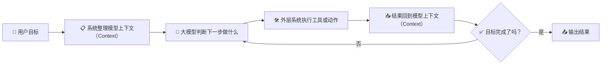

# 🤖 第四章 智能体是怎么"干活"的？

## 🤔 读前先想

- 智能体（Agent）看起来会连续做事，它到底比聊天机器人多了什么？
- 它明明还是大语言模型（Large Language Model，`LLM`），为什么会让人觉得像"自己在做事"？

## 🧭 章节定位

| 维度 | 内容 |
| --- | --- |
| 横向定位 | 这一章更偏向驾驭工程派（Harness Engineering），但会反复说明它仍然建立在大语言模型（Large Language Model，`LLM`）之上。 |
| 本章回扣 | 1. 🎯 回到本质一：智能体（Agent）底层仍然是生成文字的概率模型。<br>2. 📋 回到本质二：智能体（Agent）之所以看起来会连续做事，是因为外层系统在持续组织模型上下文（Context）、工具和多步循环。 |

---

## 🔄 总流程：一个最简单的执行循环



> 💡 **核心逻辑**：智能体（Agent）不是"变聪明了"，而是外层系统帮它把"接话的依据"组织得更完整，让它能一圈一圈地转下去。

---

## 📖 第一小节：智能体不是什么新鲜物种

### ❓ 提问

- 第二章看了那么多技术，为什么到了智能体这个阶段，AI 突然看起来会"自己做事"了？
- 这种"会自己做事"的感觉，是从模型本身变强了，还是从别的地方来的？

### 📝 术语

- **中文**：智能体
- **英文**：Agent
- **补充**：围绕目标连续完成多步任务的 AI 应用形态

### 💬 一句话解释

说白了，智能体就是"大模型 + 一堆配合它的外围系统"，像是一个会接话的人，配上了一套能干活的工作台。

### 🧐 你可以先这样理解

很多人第一次用智能体产品时，会觉得"它好像真的会自己干活"。

但别忘了第一章说的：**大模型本质上还是"接话"的概率模型**，它不会真的"规划"，也不会"动手"。

那为什么智能体看起来会连续做事？

答案是：**外围系统帮它搭了一个"工作台"**——模型负责"判断下一步说什么"，系统负责"把话说完、把事做完、把结果记好"。

### 📊 智能体的基本架构

```
                          🎯 用户目标
                       "订明天去上海的机票"
                             │
                             ▼
┌──────────────────────────────────────────────────────────┐
│                      智能体（Agent）                      │
│                                                          │
│   🎯 目标       🛠️ 工具说明      🧠 记忆      🔒 边界   │
│  "订机票"    "可查航班、下单"   "之前的操作"  "下单要确认" │
│      │              │               │             │      │
│      └──────────────┴───────┬───────┴─────────────┘      │
│                            ▼                             │
│  ┌────────────────────────────────────────────────────┐  │
│  │                📋 上下文（Context）                  │  │
│  │           "模型此刻能看到的所有信息"                  │  │
│  └──────────────────────┬─────────────────────────────┘  │
│            ▲            │                                │
│            │            ▼                                │
│            │   ┌─────────────────┐                       │
│            │   │     🧠 大模型    │                       │
│            │   │  "下一步该查航班" │                       │
│            │   └────────┬────────┘                       │
│            │            │                                │
│            │     ┌──────┴──────┐                         │
│            │     │             │                         │
│            │  需要工具      可以输出                        │
│            │     │             │                         │
│            │     ▼             │                         │
│            │  ┌──────────┐     │                         │
│            │  │ 🛠️ 执行  │     │                         │
│            │  │ 调用工具  │     │                         │
│            │  └────┬─────┘     │                         │
│            │       │           │                         │
│            │       ▼           │                         │
│            │  ┌──────────┐     │                         │
│            │  │ 📥 结果  │     │                         │
│            │  │ 回写上下文│     │                         │
│            │  └────┬─────┘     │                         │
│            │       │           │                         │
│            └───────┘           │                         │
│          继续循环               ▼                         │
│                           📤 输出结果                     │
│                        "已为您预订航班"                    │
└──────────────────────────────────────────────────────────┘
```

> 💡 **关键理解**：模型只负责中间"判断下一步"的环节，其他都是外围系统在配合。外围系统把目标、工具说明、历史结果、约束条件全写进上下文，模型基于上下文判断，系统再执行、回写，一圈一圈转下去。

### 📖 示例：改代码的场景

| | 普通聊天机器人 | 智能体形态 |
|:---|:---|:---|
| **你输入** | "帮我改个 bug" | "帮我改个 bug" |
| **AI 做什么** | 给你建议，不动手 | 读取代码 → 分析 → 修改 → 测试 → 再修改 |
| **本质区别** | 模型只"说话" | 模型"说话"+系统"做事" |

看起来是"自己会做事"，其实底层还是那个模型，只是外围系统帮它把"做事的流程"串起来了。

### ✅ 你只需要记住

| 要点 | 说明 |
|:---|:---|
| 🤖 系统形态 | 智能体是"模型+外围系统"的组合，不是新模型 |
| 🎯 分工明确 | 模型负责"判断下一步说什么"，系统负责"执行和记录" |
| 🔄 循环推进 | 看起来"连续做事"，其实是"判断→执行→再判断"在转 |

---

💭 **第1小节我们明白了**：智能体不是什么新鲜物种，而是"大模型+外围系统"的组合。那它到底是怎么"一圈一圈转下去"的？这就要说到执行循环。

## 第二小节：执行循环——智能体（Agent）的核心工作方式

### ❓ 提问

- 为什么智能体不能"一口气想完所有步骤再执行"，只能"做一步、看一步、再决定下一步"？
- 任务一长，为什么就容易乱套或忘记前面做过什么？

### 📝 术语

- **中文**：执行循环
- **英文**：Execution Loop
- **补充**："做一步，看结果，再决定下一步"的循环过程

### 💬 一句话解释

说白了，大多数智能体（Agent）的核心，就是一个不断转的循环：判断下一步 → 执行动作 → 看结果 → 再判断。

### 🧐 你可以先这样理解

为什么需要循环？因为**模型一次只能生成一段文字**。

它没法"一次性把整个任务想完再执行"。

### 📊 执行循环的运转过程

```
第1圈：判断 → 执行 → 看结果
   │
   ▼
第2圈：再判断 → 再执行 → 再看结果
   │
   ▼
第3圈：继续判断...直到完成
```

每转一圈，都要调一次模型，都要花钱。

### ⚠️ 循环拉长后的三个麻烦

| 问题 | 表现 | 例子 |
|:---|:---|:---|
| 💰 **成本** | 圈数多了费用上涨 | 一个复杂任务转了20圈，账单惊人 |
| 🔒 **权限** | 不知道该不该自动做 | 发邮件可以自动，转账需要确认 |
| 🎯 **跑偏** | 忘记最初要干嘛 | 查着查着资料，偏离了原本的目标 |

### 📊 执行循环的各个环节

| 环节 | 系统做什么 | 模型做什么 |
| --- | --- | --- |
| 🎯 接到目标 | 接收用户输入，明确任务 | — |
| 📋 整理上下文 | 把目标、工具说明、历史结果组织好 | — |
| 🧠 判断下一步 | — | 基于上下文，生成下一步动作 |
| 🛠️ 执行动作 | 真正调用工具、操作外部系统 | — |
| 📥 读取结果 | 把执行结果格式化，放回上下文 | — |
| ✅ 判断结束 | 检查目标是否完成 | 判断"该继续还是该停" |

### ✅ 你只需要记住

- 🔄 智能体（Agent）最重要的不是"会不会说"，而是"能不能围绕目标稳定地转完这个循环"
- ⚠️ 循环一拉长，成本、权限、跑偏风险都会上来
- 📋 关键还是上下文：给得越清楚，循环转得越稳

---

💭 **第2小节我们明白了**：智能体之所以能"一圈一圈转下去"，靠的是执行循环。但循环要转得稳，需要哪些条件？这就得拆解它的核心部件。

## 📖 第三小节：🎯 目标与上下文——智能体的"方向盘"和"视野"

> 💡 **一句话理解**：目标告诉智能体"要去哪"，上下文告诉它"现在在哪、能看到什么"。

### 🎯 目标与上下文的作用

```
        🎯 目标（方向盘）          📋 上下文（视野）
           │                          │
           ▼                          ▼
    ┌─────────────┐            ┌─────────────┐
    │ "要去哪"    │            │ "现在在哪"   │
    │ "做到什么   │            │ "前面做了啥" │
    │  程度算完"  │            │ "能看到啥"   │
    └──────┬──────┘            └──────┬──────┘
           │                          │
           └──────────┬───────────────┘
                      │
                      ▼
               ┌─────────────┐
               │  模型判断    │
               │ "下一步     │
               │  该做什么"  │
               └─────────────┘
```

### 📊 目标清晰 vs 模糊

| 模糊目标 ❌ | 清晰目标 ✅ |
|:---|:---|
| "帮我整理资料" | "整理5份行业报告，提取关键观点，做成对比表格" |
| 结果：不知道要整理什么、整理到什么程度 | 结果：知道范围、知道格式、知道什么时候算完成 |

### ⚠️ 上下文出问题的典型场景

| 表面现象 | 根因 | 上下文里缺了啥 |
|:---|:---|:---|
| "能读文件却读错目录" | 上下文没给对 | 正确的文件路径 |
| "转着转着忘了要干嘛" | 目标被冲淡 | 原始目标被后来的内容淹没了 |

---

## 📖 第四小节：🛠️ 工具与能力边界——智能体的"手脚"和"围栏"

> 💡 **一句话理解**：工具让智能体真的能"动手"，边界告诉它什么能做、什么不能做。

### 📊 工具的组成

| 要素 | 说明 | 例子 |
|:---|:---|:---|
| 🔧 **工具范围** | 能调什么 | 搜索、发邮件、改文件、查数据库 |
| 📖 **工具说明** | 怎么用、参数是啥 | "日期参数要传时间戳格式" |
| 🔌 **连接方式** | 怎么接入 | MCP 协议标准化接入 |

⚠️ **工具说明不清楚会怎样？**
```
模型以为："日期" = "2024-01-01"
工具实际要："日期" = 1704067200（时间戳）
结果：调用失败
```

### 📊 三类边界

| 边界 | 控制什么 | 不设边界的后果 |
|:---|:---|:---|
| 💰 **成本边界** | 循环次数、调用量 | 账单爆炸 💥 |
| 🔐 **安全边界** | 哪些操作要确认 | 误发邮件、误转账 |
| ⏹️ **终止边界** | 什么时候算"做完" | 无限循环、停不下来 |

---

## 📖 第五小节：🔄 执行循环与记忆——智能体的"心跳"和"承接"

> 💡 **一句话理解**：执行循环让智能体能"一步步往前走"，记忆让它能"记得之前做过什么"。

### 📊 执行循环 vs 直线执行

| 直线执行（做不到） ❌ | 执行循环（实际做法） ✅ |
|:---|:---|
| 模型"一口气"想完所有步骤 | 模型一次只判断"下一步" |
| 然后一次性执行完 | 执行完一步，看结果，再判断 |
| **为什么做不到**：模型只能生成一段文字，没法"全想好" | **为什么这样设计**：每步基于最新结果调整 |

### 💰 循环带来的问题

```
第1圈：调模型 ──► 花钱
   │
第2圈：调模型 ──► 再花钱
   │
第3圈：调模型 ──► 继续花钱...
```

| 问题 | 关键挑战 |
|:---|:---|
| ⚡ **效率** | 怎么减少不必要的循环？ |
| 🎯 **稳定** | 怎么确保每圈都朝着目标？ |

### 🧠 记忆的作用：多步任务的"承接"

```
第1步 ──► 记住结果 ──► 第2步 ──► 记住结果 ──► 第3步
          │                     │
          └─────── 上下文 ──────┘
```

**没有记忆会怎样？**

| 步骤 | 该记住的 | 实际 |
|:---|:---|:---|
| 第1步查资料 | 查到了A、B、C | ✅ 记住了 |
| 第2步整理 | 要基于A、B、C整理 | ❌ 忘了A、B、C是啥 |
| 第3步输出 | 输出整理结果 | ❌ 完全断了线，重新开始 |

---

## 📖 第六小节：举个例子串起来——所有部件怎么协作

### 场景：让智能体帮你准备明天的演讲

**目标**（🎯）：
> "帮我准备明天的部门分享：主题是 AI 在办公场景的应用，需要一份 5 分钟的发言稿和配套 PPT 大纲"

**执行过程**：

| 循环 | 上下文里有什么 | 模型判断 | 执行动作 |
| --- | --- | --- | --- |
| 第1圈 | 目标 + 工具说明 | "需要先查一些资料" | 调用搜索工具 |
| 第2圈 | 目标 + 搜索结果 | "资料够了，开始整理大纲" | 整理 PPT 大纲 |
| 第3圈 | 目标 + 大纲 | "现在写发言稿" | 写发言稿 |
| 第4圈 | 目标 + 大纲 + 发言稿 | "检查是否完整" | 自检完成 |

**关键部件协作**：
- 🎯 **目标**：始终保存在上下文里，防止跑偏
- 📋 **上下文**：每圈都包含历史结果
- 🛠️ **工具**：搜索、整理、写作
- 🔒 **边界**：每圈都检查成本和时间
- 🧠 **记忆**：大纲和发言稿一直保留在上下文里

---

## 📝 本章要义

> 💡 **一句话核心结论**：智能体（Agent）不是突然出现的"新物种"，而是把之前学到的所有要素——**模型能力、工具调用、上下文管理、执行循环**——整合在一起的自然产物。

---

### 🔗 核心脉络回顾

| 小节 | 关键认知 | 递进关系 |
| :--- | :--- | :--- |
| 📖 第1节 | 智能体是"模型+系统"的组合，不是新物种 | 回答了"是什么" |
| 📖 第2节 | 执行循环："判断→执行→看结果→再判断"的循环机制 | 回答了"怎么转起来" |
| 📖 第3节 | 目标与上下文：方向盘和视野，决定往哪走、能看到什么 | 拆解第一个核心部件 |
| 📖 第4节 | 工具与边界：手脚和围栏，决定能做什么、什么不能做 | 拆解第二个核心部件 |
| 📖 第5节 | 执行循环与记忆：心跳和承接，决定能否持续稳定推进 | 拆解第三个核心部件 |
| 📖 第6节 | 综合示例：所有部件如何协作完成一个真实任务 | 串起来看整体 |

---

### 🎯 回到两个本质

| 本质 | 核心理解 |
| :--- | :--- |
| 🎯 **本质一（概率模型）** | 智能体底层仍然是那个"接话"的概率模型。它不会真的"思考"或"计划"，只是在更丰富的上下文里判断"下一步该说什么"。 |
| 📋 **本质二（上下文）** | 智能体之所以能"连续做事"，是因为外层系统把目标、工具说明、历史结果、约束条件等更多信息，持续地组织进上下文。上下文范围越大、越清晰，智能体表现得越"聪明"。 |

---

### 🧩 智能体是自然演进的综合产物

回顾前几章的内容，智能体的出现不是偶然：

| 演进阶段 | 学到什么 | 在智能体中的作用 |
| :--- | :--- | :--- |
| 💬 ChatGPT 时刻 | 模型只能"接话" | 底层基础，始终不变 |
| 🔍 RAG | 上下文可以扩展 | 智能体需要持续补充信息 |
| 🛠️ 工具调用 | 模型可以"发号施令" | 智能体真正"动手"的能力 |
| 📋 工作流 | 流程可以组织 | 智能体需要稳定的执行框架 |
| 🧠 记忆系统 | 历史可以保留 | 多步任务需要承接上下文 |

**智能体 = 模型能力 + 工具调用 + 上下文管理 + 执行循环 + 记忆系统 + 边界约束**

它不是某个单一技术的突破，而是所有这些要素发展到一定阶段后，**自然而然整合出来的形态**。

---

### 🌉 为下一章铺垫

明白了智能体是怎么工作的，下一个问题自然来了：

市面上有那么多智能体产品——OpenAI 的、Claude 的、各种开源的、企业自己搭的...**它们表面名字不同，但底层部件的组合方式，才是决定体验差距的关键**。

怎么把这些产品放到同一张图里对比？哪些部件设计得好，哪些有坑？

这就是第五章要聊的：**把几个典型 Agent 产品放在一起看**。
